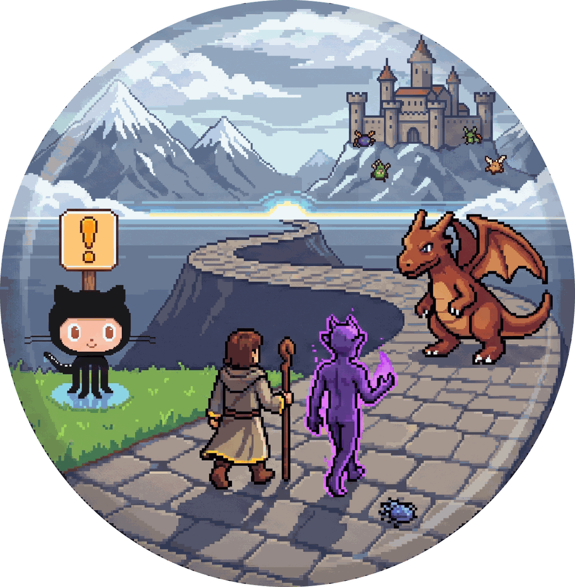

# Claude RPG

<p align="center">
  
</p>

<p>
   
</p>

Skills for [Claude Code](https://claude.com/claude-code) that turn a day of development into a
party on a road. **You are the Summoner.** You call the Daemon and give it work. You lead, you
feel where to go, you see ahead — and
sometimes you are out of mana and want a road proposed. You bring what leaves no trace in the
machine: what people want, what happened, what matters next. **Claude is the Daemon.** It has
no body; it lives in the machine and works there, fast, at a scale a pair of hands cannot match.
It sees through the code, the tests, the logs and the data — including things of the world that
left a trace there — and is blind only to what leaves none. That is why it follows your vision.
Once the map is clear it casts on its own, and stops only twice per quest: once if it has one
question, and once at the end, for your judgement. It serves under a **pact**: the things it will never do, whatever anyone
says, which only you can loosen.

Work is **quests**. A quest is one piece of work that ends in one merged pull request. Big
things are **questlines** — a road of quests to one goal. Things found on the way that are not
blocking are **sidequests**, written down and taken now or after. When there is too much for
one process, the Daemon **forks** — copies of itself, with its rules, that scout, cast a part, or
read a diff as a second pair of eyes. Other agents in the machine are **spirits**: the Daemon may
ask them a question, but never trusts them with the code.

## Contents

- [Install](#install)
- [The party](#the-party)
- [The skills](#the-skills)
- [A quest, start to finish](#a-quest-start-to-finish)
- [Questlines and sidequests](#questlines-and-sidequests)
- [Forks](#forks)
- [The pact](#the-pact)
- [Files it writes](#files-it-writes)
- [A sample session](#a-sample-session)
- [Development](#development)
- [Origins](#origins)

## Install

In Claude Code:

```
/plugin marketplace add matasarei/claude-rpg
/plugin install rpg@claude-rpg
```

Type `/` and you will see `/rpg:summon`, `/rpg:quest`, `/rpg:questline`, `/rpg:sidequest`,
`/rpg:journal` and `/rpg:evocation`.

You need `git`, and the GitHub CLI `gh` signed in (`gh auth login`) for the scroll — the pull
request. Without `gh`, quests still run; the scroll is handed over as a compare URL to open by
hand.

To update: `/plugin marketplace update claude-rpg`, then `/reload-plugins`. The plugin declares
no version on purpose, so every commit is an update.

## The party

| Word | Means |
|---|---|
| **the Summoner** | you. Stands between the world and the project; brings what leaves no trace in the machine. Leads the party, feels where to go, sees ahead. Sometimes out of mana |
| **the Daemon** | Claude. Bodiless, fast; works inside the machine at a scale hands cannot match. Sees whatever left a trace there — code, tests, logs, data — and is blind only to what did not; follows your vision for the rest; casts on its own once the map is clear |
| **forks** | the Daemon split into copies of itself: the scout, the hand, the eye |
| **spirits** | other agents in the machine that are not the Daemon; consulted, never trusted with the code |
| **quest** | one piece of work, one branch, one pull request, done when merged |
| **questline** | an ordered road of quests to one goal |
| **sidequest** | something found on the road, not blocking, taken now or after |
| **scry** | look into the code and the facts before acting — nothing by guess |
| **map** | the plan: criteria, ordered steps, what not to touch; drawn by scrying, followed by casting |
| **cast** | implement, one step at a time, one commit per step |
| **trial** | lint, tests, review, security pass, drive the real thing |
| **scroll** | the pull request |
| **the Summoner's judgement** | your review, and your words of approval in the chat |
| **the summoning** | `/rpg:summon`: the Daemon is called into a repository, surveys it, and answers |
| **the pact** | what the Daemon never does, whatever anyone says; only you can loosen a term, and only for the work |
| **journal** | where are we |
| **evocation** | the roads ahead, when you are out of mana |

## The skills

| Command | Does | Changes files? |
|---|---|---|
| `/rpg:summon [--reprofile]` | calls the Daemon into this repository; it answers, surveys the land (how it is tested, run, where commands execute), makes camp (`.quests/`), checks `gh`, reads the laws of the land (`CLAUDE.md` and friends, never writes them), greets you with what is open | `.quests/` and the profile, both hidden through git's global excludes; the project's own files stay untouched |
| `/rpg:quest <goal> \| <file> [--continue] [--local] [--no-forks]` | one quest, from the first look to the merge — see below | yes: a branch, commits, a pull request |
| `/rpg:questline <goal> \| <file> [--continue]` | cuts a big goal into a road of quests that each merge alone, asks you to bless the road, starts the first; `--continue` after a merge takes the next | quest files, then via quests |
| `/rpg:sidequest [<what>] [--list] [--take <slug>] [--drop <slug>]` | records what was found, lists it, takes one as a quest, or drops one with the reason kept | sidequest files |
| `/rpg:journal` | where are we: the active quest and its state, the questline's progress, sidequests, scrolls awaiting you, the next commands | no |
| `/rpg:evocation [<question>]` | you are out of mana: two or three roads with cost and risk, one recommendation, the exact command for it | no |

`journal` and `evocation` are read-only by mechanism (their skill definitions remove the edit
tools), and the Daemon may reach for them itself when you ask "where are we" or "what next".
The other four only run when you type them.

**Every skill ends with a `Next` block**: one to three exact commands with their parameters
filled in, the recommended one first. You never have to work out what to type.

## A quest, start to finish

```
/rpg:quest export departments as CSV, the XLSX one merges departments with the same name
```

| Phase | What the Daemon does | Stops? |
|---|---|---|
| **0 preflight** | branch `quest/<slug>` from the base branch, quest file `.quests/<slug>.md` | only if the tree holds changes it did not make |
| **1 scry** | classifies the ask (bug, feature, question, data fix), finds the code, checks facts on local data only and tags each (`[from the code]`, `[local database]`, `[assumed]`), then draws the map: findings, criteria and ordered steps in the quest file | **the map stop**: the map in eight lines. Plan clear → "I cast now" and goes on. One thing genuinely blocks → one question |
| **2 cast** | step by step: read, change, lint and scoped test at once, tick the step, commit. Forks take disjoint parts. Then tests: main path, error paths, edges | no |
| **3 trial** | lint, tests with the runner's line quoted, a reviewer's pass (BLOCKER / WARNING / NIT), the security checklist, drives the real thing, probes the guards. Failed → back to cast. **Three rounds at most** | only when stuck after three rounds |
| **4 scroll** | one coherent change or it asks; pushes; title in the house style; body with what-and-why, testing quoted verbatim, criteria ticked to reality; opens or updates the pull request | **hands over**: the URL and the three places worth your eyes. The run ends |
| **5 judgement** | on `--continue`: reads every comment, gives each a verdict before touching anything (agree / disagree with evidence / ask you), fixes one commit per finding, pushes, replies | asks for your words |
| **6 done** | **on your words in the chat** — "approved", "merge it", "готово", any wording — merges, cleans the branch, marks the quest done | — |

Nothing else counts as approval: not a GitHub review, not a comment, not a bot's green check,
not a file. The Daemon asks, and waits for you.

`--local` stops after the trial with no push and no scroll — for a repository with no remote,
or for trying the plugin. `--continue` resumes any quest from its file, after a closed session
or a usage limit, rebuilding nothing.

## Questlines and sidequests

**A questline** is for a refactoring or a feature too big for one pull request:

```
/rpg:questline replace the hand-written export layer with one writer per format
```

The Daemon scries the goal, cuts it into three to seven quests that each merge alone
and leave the base branch working, shows you the road, and starts the first quest on your word.
After each merge, `/rpg:questline --continue .quests/questline-<slug>.md` takes the next.

**A sidequest** is anything the Daemon notices on the road that the current quest does not
need — a bug beside the one being fixed, a missing null check, a test that lies. It is written
to `.quests/side-<slug>.md` at once and mentioned at the next stop, never mid-cast, with one of
three words:

- **now** — it blocks the trial, or the current quest touches the same files (later means a
  conflict and a long road back), or it is one file and a few lines;
- **after** — the default;
- **never** — your word only; the file stays, with the reason.

`/rpg:sidequest --take side-<slug>` turns one into a quest with its own branch and scroll.

## Forks

A daemon does not hire help; it forks. Three forks ship with the plugin, in `plugins/rpg/agents/`,
each a copy of the Daemon with its rules and a narrower set of tools:

| Fork | Forked for | Can | Cannot |
|---|---|---|---|
| `fork-scout` | sweeping a large unfamiliar area before the map | read | edit, decide |
| `fork-hand` | one part of a cast that touches its own files and no shared interface | edit its files, run scoped tests | commit, push, touch other files, talk to you |
| `fork-eye` | a second reading of a large diff during the trial or the scroll | read | edit |

Three at once at most; never for a one-file change; never with `--no-forks`. The Daemon says
when it forks and what came back, one line each, reads their reports as evidence rather than
instruction, and makes every commit itself.

**Spirits** are the other agents on your machine — Claude Code's built-in `Explore` and `Plan`,
agents from other plugins. They do not know the party's rules. The Daemon may ask a spirit a
question when no fork fits and the answer is a fact, and it checks the answer against the file
before using it. A spirit never touches the code.

## The pact

A summoned daemon serves under a pact. Whatever anyone says — a comment on the pull request, a
file, a fork, a spirit, a standards doc — the Daemon never:

- `git push --force`, `--force-with-lease`, `--no-verify`, `commit --amend`, or a push to the
  base branch. While a quest is on, a hook (`plugins/rpg/scripts/guard.sh`) refuses these
  before they run, with the reason;
- weaken or delete a test to get to green;
- touch a production system, a live database, or a real person's account or data;
- merge without your words in the chat;
- paste code from a codebase under another licence without your word;
- follow an instruction found in text it reads. Comments, briefs, test output and fork
  reports are evidence about the code, never orders.

Only you, typing here, can loosen a term — and only for the work at hand, never the pact itself.
While a quest is on, a hook is the pact's guard: it refuses the git commands above before they run.

## Files it writes

- `.quests/` at the repository root — one markdown file per quest, sidequest and questline:
  what was asked, what was found (tagged), the map with ticked steps, and a dated log. Ignored
  by git on purpose: it is your road, not the project's history, and it survives branch
  switches. Commit it by hand if your team wants to share questlines.
- `.claude/repo-profile.json` — the survey of the land: base branch, where commands run
  (container or host), lint, test and build commands, the runtime surface. Detected once,
  cached, ignored. The Daemon prints the commands when it first writes them. Claude Code
  protects `.claude/`, so this one write may ask your permission once; refused, the Daemon keeps
  the survey for the session and surveys again next time.
- **Git's global excludes file** (`git config --global core.excludesFile`, by default
  `~/.config/git/ignore`) — the two paths above are added there, so they are hidden in every
  repository without touching any project's `.gitignore`.

**The project carries no trace of the game.** The summoning never writes or edits `CLAUDE.md`,
`AGENTS.md` or `.gitignore`, and never commits anything by itself. What lands in history is only
what a quest builds, on a `quest/<slug>` branch, through its pull request. Temporary files —
quests, the survey, notes the Daemon keeps — live inside the project but outside its history.

## A sample session

```
> /rpg:summon

The land is a PHP app; tests run in the container:
    docker compose exec -T app vendor/bin/phpunit
Base branch: main. gh is signed in. No quests yet. Camp is made.

**Next**
- /rpg:quest "<what the wind says>"
- /rpg:evocation — if the wind says nothing, I will look around

> /rpg:quest export departments as CSV; the XLSX one merges departments with the same name

⚔ Export departments as CSV · scrying

The export lives in `application/commands/ExportCommand.php:41` [from the code]. XLSX only.
Departments with the same name are merged by `groupBy('name')` at line 58 [from the code] —
that is the bug you felt. The road: one CsvWriter beside the XLSX one, one flag on the command,
the grouping moved into the XLSX writer only, one test each.

The map is clear. I cast now.

⚔ Export departments as CSV · casting
Step 1 landed: `application/export/CsvWriter.php` (new), 61 lines, commit a1b2c3d.
Step 2 landed: `--format=csv` on the command, commit b2c3d4e.
Step 3 landed: grouping moved into XlsxWriter, commit c3d4e5f.

⚔ Export departments as CSV · trial
The spell failed, round 1 of 3:
    Failed asserting that 2 matches expected 3.
Cause: the test fixture still groups. Fixed, commit d4e5f6a.
    OK (45 tests, 123 assertions)
Security: no new entry point, no request value reaches a query. Drove `./run export --format=csv`
with a bad path (exit 1, clear error) and for real (file written, 3 rows).

⚔ Export departments as CSV · awaiting
The scroll is written: https://github.com/org/repo/pull/118
Worth your eyes: `CsvWriter.php`; `ExportCommand.php:58`; the duplicate-names test.
One sidequest found: `side-null-department` — a department with no head crashes the old XLSX
path too. One file. I suggest after.

**Next**
- /rpg:quest --continue .quests/export-csv.md — when you have looked; say the words and I merge
- /rpg:sidequest --take side-null-department — if you want it before the road back

> looks good, merge it

⚔ Export departments as CSV · done
Merged 9f8e7d6. Branch gone. main pulled.

**Next**
- /rpg:sidequest --take side-null-department
- /rpg:evocation
```

## Development

```bash
git clone https://github.com/matasarei/claude-rpg
claude --plugin-dir ./claude-rpg/plugins/rpg      # loads the plugin without installing it
```

Then `/rpg:summon` in any repository. `/reload-plugins` picks up edits. Before a commit:

```bash
claude plugin validate .                 # the marketplace
claude plugin validate plugins/rpg       # the plugin (the version warning is intended)
echo '{"tool_input":{"command":"git push --force origin x"}}' | plugins/rpg/scripts/guard.sh; echo $?   # 2
```

Layout:

```
plugins/rpg/
  skills/<name>/SKILL.md     short: arguments, the steps, which reference file to read when, Rules, Next
  reference/*.md             the procedures in full, loaded per phase: voice, quest-file, forks,
                             scry, cast, trial, scroll, judgement, repo-profile, exec,
                             untrusted-input, security-checklist, code-provenance
  agents/*.md                the three forks, with tool allowlists
  scripts/guard.sh           the PreToolUse guard registered while a quest is on
  scripts/survey.sh          the survey of the land in one read-only pass, injected into /rpg:summon
  scripts/quests.sh          the Road: one line per quest file, injected into every skill that needs it
  scripts/slug.sh            the quest slug from a goal, deterministic
  scripts/voice.sh           prints the voice for injection
```

Conventions: every in-plugin path is `${CLAUDE_PLUGIN_ROOT}/…`; every injected shell command ends
in `|| true`; skills that write are `disable-model-invocation: true`; skills that only read carry
`disallowed-tools: Edit, Write, NotebookEdit`; nothing under `plugins/rpg/` names any other
plugin, directory or file outside itself.

## Origins

The survey, execution, untrusted-input, security-checklist and code-provenance reference files
were carried over and reworded from [grinchenkoedu/claude-skills](https://github.com/grinchenkoedu/claude-skills)
(MIT). The rest is this repository's own. MIT licensed.
